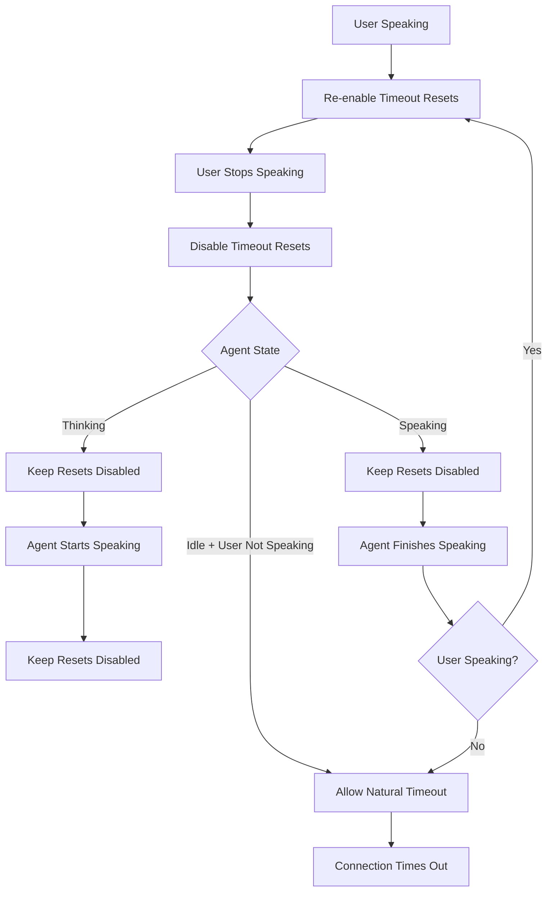

# VAD Events and Idle Timeout Behavior

This document explains how the DeepgramVoiceInteraction component handles Voice Activity Detection (VAD) events and idle timeout behavior, including redundancy management and agent state integration.

## VAD Event Sources

The component receives VAD signals from two different Deepgram services:

### 1. Agent Service (WebSocket)
- **Message Type**: `UserStartedSpeaking`
- **Callback**: `onUserStartedSpeaking`
- **Data**: None
- **Purpose**: Indicates user has started speaking from agent perspective

- **Message Type**: `UserStoppedSpeaking` ❌ **DOES NOT EXIST**
- **Status**: **Fictional Event** - This event is not part of the Deepgram API
- **Note**: Use `UtteranceEnd` for speech end detection instead

### 2. Transcription Service (WebSocket)  
- **Message Type**: `SpeechStarted`
- **Callback**: `onUserStartedSpeaking` (same callback as agent)
- **Data**: `{ channel: number[]; timestamp: number }`
- **Purpose**: Real-time voice activity detection from transcription service

- **Message Type**: `SpeechStopped` ❌ **DOES NOT EXIST**
- **Status**: **Fictional Event** - This event is not part of the Deepgram API
- **Note**: Use `UtteranceEnd` for speech end detection instead

- **Message Type**: `UtteranceEnd`
- **Callback**: `onUtteranceEnd`
- **Data**: `{ channel: number[]; lastWordEnd: number }`
- **Purpose**: End-of-speech detection based on Deepgram's utterance detection

## End-of-Speech Detection

The component follows Deepgram's recommended pattern for detecting when a user has finished speaking:

### Speech Detection Signals

1. **`speech_final=true`** in transcript results (from Endpointing feature)
   - Callback: `onUserStoppedSpeaking`
   - Triggers when Deepgram's VAD detects silence after speech
   - **When this fires, subsequent UtteranceEnd messages are ignored**

2. **`UtteranceEnd`** message (from UtteranceEnd feature)
   - Callback: `onUtteranceEnd` and `onUserStoppedSpeaking`
   - Triggers when word timing gap exceeds `utterance_end_ms` threshold
   - **Only processed if NO `speech_final=true` was received**

### Recommended Pattern (Per Deepgram Docs)

According to [Deepgram's official documentation](https://developers.deepgram.com/docs/understanding-end-of-speech-detection#using-utteranceend):

> When using both features in your app, you may want to trigger your "speaker has finished speaking" logic using the following rules:
> 
> - trigger when a transcript with `speech_final=true` is received (which may be followed by an `UtteranceEnd` message which can be ignored)
> - trigger if you receive an `UtteranceEnd` message with no preceding `speech_final=true` message and send the last-received transcript for further processing

### Implementation

The component implements this by:
1. Setting a flag when `speech_final=true` is received
2. Checking this flag before processing `UtteranceEnd` messages
3. Resetting the flag when new speech starts (`SpeechStarted`)

This ensures `isUserSpeaking` becomes `false` when **EITHER**:
- `speech_final=true` is received (ignore UtteranceEnd), OR
- `UtteranceEnd` is received with NO preceding `speech_final=true`

## Architecture: IdleTimeoutService

The component uses a dedicated `IdleTimeoutService` for clean separation of concerns:

### Event-Driven Design

The service handles idle timeout through events rather than complex state watching:

```typescript
// Events that affect idle timeout behavior
type IdleTimeoutEvent = 
  | { type: 'USER_STARTED_SPEAKING' }
  | { type: 'USER_STOPPED_SPEAKING' }
  | { type: 'AGENT_STATE_CHANGED'; state: string }
  | { type: 'PLAYBACK_STATE_CHANGED'; isPlaying: boolean }
  | { type: 'MEANINGFUL_USER_ACTIVITY'; activity: string };
```

### Clean Separation

- **Speech Detection**: Handled by the main component using reducer state
- **Idle Timeout Management**: Handled by `IdleTimeoutService`
- **WebSocket Activity**: Detected by `WebSocketManager` and reported via callbacks

### Benefits

1. **Single Responsibility**: Each service has one clear purpose
2. **Testable**: Services can be tested independently
3. **Maintainable**: Clear boundaries between concerns
4. **Event-Driven**: Reactive architecture using events

## Signal Redundancy

### The Problem
When a user stops speaking, **only one real VAD signal fires**:
1. `UtteranceEnd` from transcription service ✅ **REAL EVENT**

**Note**: `UserStoppedSpeaking` and `SpeechStopped` are fictional events that don't exist in the Deepgram API.

### Current Behavior
- Only `UtteranceEnd` signal is processed (fictional events removed)
- Updates internal state (`isUserSpeaking: false`)
- Clean, single-source signal handling

### Recommended Handling Strategy

#### For Component Developers
```typescript
// Choose ONE primary signal for business logic
const primarySignal = 'UtteranceEnd'; // Most reliable

// Use others for validation/warnings
const validateWithSpeechStopped = true;
const validateWithAgent = true;

// Handle conflicts
if (signalsDisagree) {
  console.warn('VAD signals disagree - using primary signal');
}
```

#### For Application Developers
```typescript
// Option 1: Use only primary signal
<DeepgramVoiceInteraction
  onUtteranceEnd={handleUserStoppedSpeaking}
  // Don't wire other VAD callbacks
/>

// Option 2: Use all signals with conflict detection
<DeepgramVoiceInteraction
  onUtteranceEnd={handlePrimaryVAD}
  onVADEvent={handleSecondaryVAD}
  onUserStoppedSpeaking={handleTertiaryVAD}
/>
```

## Agent State Transitions

The component tracks agent states and should integrate them with idle timeout behavior:

### Agent States
```typescript
type AgentState = 'idle' | 'listening' | 'thinking' | 'speaking' | 'entering_sleep' | 'sleeping';
```

### State Transitions
```
User speaks → 'listening' → 'thinking' → 'speaking' → 'idle'
```

### Agent Message Types
- **`AgentThinking`** → `'thinking'` state
- **`AgentStartedSpeaking`** → `'speaking'` state  
- **`AgentAudioDone`** → `'idle'` state

## Idle Timeout State Machine

### Current Behavior (Issue #85 - FIXED)
- ✅ `VADEvent speechDetected: true` → Re-enable idle timeout resets
- ✅ `VADEvent speechDetected: false` → Keep idle timeout resets disabled
- ✅ `UtteranceEnd` → Disable idle timeout resets

### Missing Behavior (Issue #86 - TODO)
- ❌ `AgentThinking` → Should disable idle timeout resets
- ❌ `AgentStartedSpeaking` → Should disable idle timeout resets
- ❌ `AgentAudioDone` → Should re-enable idle timeout resets (if user not speaking)

### Recommended State Machine



## Implementation Guidelines

### 1. VAD Signal Priority
```typescript
// Only real event available:
// 1. UtteranceEnd (only real Deepgram event for speech end detection)
```

### 2. Conflict Detection
```typescript
const detectVADConflicts = (events: VADEvent[]) => {
  const timeWindow = 1000; // 1 second
  const recentEvents = events.filter(e => 
    Date.now() - e.timestamp < timeWindow
  );
  
  return recentEvents.length > 1;
};
```

### 3. Idle Timeout Integration
```typescript
// Agent state handlers should manage idle timeouts
const handleAgentThinking = () => {
  dispatch({ type: 'AGENT_STATE_CHANGE', state: 'thinking' });
  disableIdleTimeoutResets(); // NEW
};

const handleAgentSpeaking = () => {
  dispatch({ type: 'AGENT_STATE_CHANGE', state: 'speaking' });
  disableIdleTimeoutResets(); // NEW
};

const handleAgentIdle = () => {
  dispatch({ type: 'AGENT_STATE_CHANGE', state: 'idle' });
  if (!isUserSpeaking) {
    enableIdleTimeoutResets(); // NEW
  }
};
```

## Testing Strategy

### 1. VAD Redundancy Tests
- Detect multiple signals for same event
- Validate timing consistency
- Test conflict resolution

### 2. Agent State Timeout Tests
- Verify agent thinking disables timeouts
- Verify agent speaking disables timeouts
- Verify agent idle re-enables timeouts

### 3. State Machine Tests
- Test complete conversation cycles
- Validate enable/disable sequences
- Test natural timeout behavior

## Migration Guide

### For Existing Applications

#### Before (Current)
```typescript
// All VAD callbacks fire independently
<DeepgramVoiceInteraction
  onUserStoppedSpeaking={handleUserStopped}
  onUtteranceEnd={handleUtteranceEnd}
  onVADEvent={handleVADEvent}
/>
```

#### After (Recommended)
```typescript
// Choose primary signal, use others for validation
<DeepgramVoiceInteraction
  onUtteranceEnd={handlePrimaryVAD}
  onUserStoppedSpeaking={handleSecondaryVAD} // For validation only
  // Note: SpeechStopped events use the same onUserStoppedSpeaking callback
/>
```

### Breaking Changes
- None planned - all changes are additive
- Existing callbacks continue to work
- New behavior is opt-in via configuration

## Related Issues

- **Issue #85**: VAD events should only re-enable idle timeout resets when speech detected ✅ FIXED
- **Issue #86**: Respect agent state transitions for idle timeout behavior ❌ TODO

## References

- [Deepgram End-of-Speech Detection](https://developers.deepgram.com/docs/understanding-end-of-speech-detection)
- [Deepgram Voice Activity Detection](https://developers.deepgram.com/docs/voice-activity-detection)
- [Deepgram Agent API Specification](https://developers.deepgram.com/docs/agent-api)
