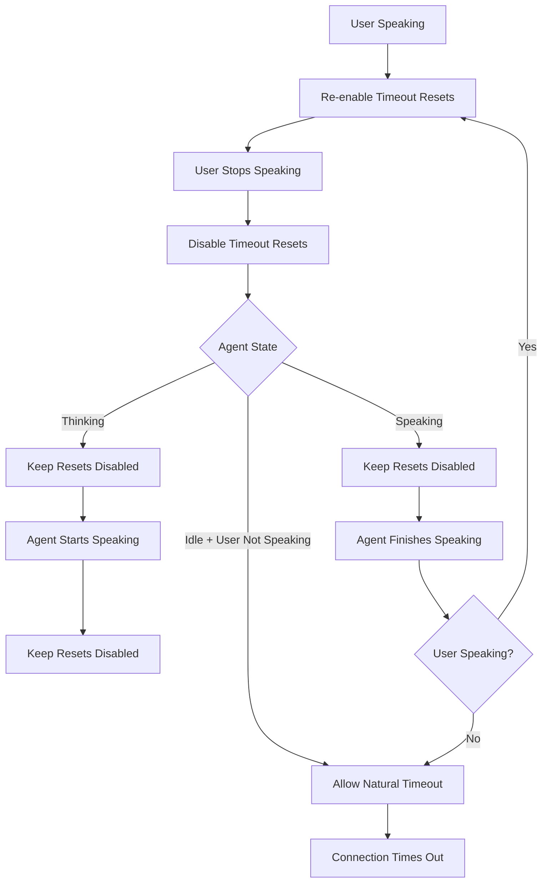

# VAD Events and Idle Timeout Behavior

This document explains how the DeepgramVoiceInteraction component handles Voice Activity Detection (VAD) events and idle timeout behavior, including redundancy management and agent state integration.

## VAD Event Sources

The component receives VAD signals from two different Deepgram services:

### 1. Agent Service (WebSocket)
- **Message Type**: `UserStartedSpeaking`
- **Callback**: `onUserStartedSpeaking`
- **Data**: None
- **Purpose**: Indicates user has started speaking from agent perspective

- **Message Type**: `UserStoppedSpeaking`
- **Callback**: `onUserStoppedSpeaking`
- **Data**: `{ timestamp?: number }`
- **Purpose**: Indicates user has stopped speaking from agent perspective

### 2. Transcription Service (WebSocket)  
- **Message Type**: `SpeechStarted`
- **Callback**: `onUserStartedSpeaking` (same callback as agent)
- **Data**: `{ channel: number[]; timestamp: number }`
- **Purpose**: Real-time voice activity detection from transcription service

- **Message Type**: `SpeechStopped`
- **Callback**: `onUserStoppedSpeaking` (same callback as agent)
- **Data**: `{ channel: number[]; timestamp: number }`
- **Purpose**: Real-time voice activity detection from transcription service

- **Message Type**: `UtteranceEnd`
- **Callback**: `onUtteranceEnd`
- **Data**: `{ channel: number[]; lastWordEnd: number }`
- **Purpose**: End-of-speech detection based on Deepgram's utterance detection

## Signal Redundancy

### The Problem
When a user stops speaking, **multiple VAD signals fire simultaneously**:
1. `UserStoppedSpeaking` from agent service
2. `SpeechStopped` from transcription service
3. `UtteranceEnd` from transcription service

### Current Behavior
- All three signals are processed independently
- Each updates the same internal state (`isUserSpeaking: false`)
- No conflict resolution or validation
- Potential for timing inconsistencies

### Recommended Handling Strategy

#### For Component Developers
```typescript
// Choose ONE primary signal for business logic
const primarySignal = 'UtteranceEnd'; // Most reliable

// Use others for validation/warnings
const validateWithSpeechStopped = true;
const validateWithAgent = true;

// Handle conflicts
if (signalsDisagree) {
  console.warn('VAD signals disagree - using primary signal');
}
```

#### For Application Developers
```typescript
// Option 1: Use only primary signal
<DeepgramVoiceInteraction
  onUtteranceEnd={handleUserStoppedSpeaking}
  // Don't wire other VAD callbacks
/>

// Option 2: Use all signals with conflict detection
<DeepgramVoiceInteraction
  onUtteranceEnd={handlePrimaryVAD}
  onVADEvent={handleSecondaryVAD}
  onUserStoppedSpeaking={handleTertiaryVAD}
/>
```

## Agent State Transitions

The component tracks agent states and should integrate them with idle timeout behavior:

### Agent States
```typescript
type AgentState = 'idle' | 'listening' | 'thinking' | 'speaking' | 'entering_sleep' | 'sleeping';
```

### State Transitions
```
User speaks → 'listening' → 'thinking' → 'speaking' → 'idle'
```

### Agent Message Types
- **`AgentThinking`** → `'thinking'` state
- **`AgentStartedSpeaking`** → `'speaking'` state  
- **`AgentAudioDone`** → `'idle'` state

## Idle Timeout State Machine

### Current Behavior (Issue #85 - FIXED)
- ✅ `VADEvent speechDetected: true` → Re-enable idle timeout resets
- ✅ `VADEvent speechDetected: false` → Keep idle timeout resets disabled
- ✅ `UtteranceEnd` → Disable idle timeout resets

### Missing Behavior (Issue #86 - TODO)
- ❌ `AgentThinking` → Should disable idle timeout resets
- ❌ `AgentStartedSpeaking` → Should disable idle timeout resets
- ❌ `AgentAudioDone` → Should re-enable idle timeout resets (if user not speaking)

### Recommended State Machine



## Implementation Guidelines

### 1. VAD Signal Priority
```typescript
// Recommended priority order:
// 1. UtteranceEnd (most reliable)
// 2. SpeechStopped (real-time from transcription)
// 3. UserStoppedSpeaking (agent perspective)
```

### 2. Conflict Detection
```typescript
const detectVADConflicts = (events: VADEvent[]) => {
  const timeWindow = 1000; // 1 second
  const recentEvents = events.filter(e => 
    Date.now() - e.timestamp < timeWindow
  );
  
  return recentEvents.length > 1;
};
```

### 3. Idle Timeout Integration
```typescript
// Agent state handlers should manage idle timeouts
const handleAgentThinking = () => {
  dispatch({ type: 'AGENT_STATE_CHANGE', state: 'thinking' });
  disableIdleTimeoutResets(); // NEW
};

const handleAgentSpeaking = () => {
  dispatch({ type: 'AGENT_STATE_CHANGE', state: 'speaking' });
  disableIdleTimeoutResets(); // NEW
};

const handleAgentIdle = () => {
  dispatch({ type: 'AGENT_STATE_CHANGE', state: 'idle' });
  if (!isUserSpeaking) {
    enableIdleTimeoutResets(); // NEW
  }
};
```

## Testing Strategy

### 1. VAD Redundancy Tests
- Detect multiple signals for same event
- Validate timing consistency
- Test conflict resolution

### 2. Agent State Timeout Tests
- Verify agent thinking disables timeouts
- Verify agent speaking disables timeouts
- Verify agent idle re-enables timeouts

### 3. State Machine Tests
- Test complete conversation cycles
- Validate enable/disable sequences
- Test natural timeout behavior

## Migration Guide

### For Existing Applications

#### Before (Current)
```typescript
// All VAD callbacks fire independently
<DeepgramVoiceInteraction
  onUserStoppedSpeaking={handleUserStopped}
  onUtteranceEnd={handleUtteranceEnd}
  onVADEvent={handleVADEvent}
/>
```

#### After (Recommended)
```typescript
// Choose primary signal, use others for validation
<DeepgramVoiceInteraction
  onUtteranceEnd={handlePrimaryVAD}
  onUserStoppedSpeaking={handleSecondaryVAD} // For validation only
  // Note: SpeechStopped events use the same onUserStoppedSpeaking callback
/>
```

### Breaking Changes
- None planned - all changes are additive
- Existing callbacks continue to work
- New behavior is opt-in via configuration

## Related Issues

- **Issue #85**: VAD events should only re-enable idle timeout resets when speech detected ✅ FIXED
- **Issue #86**: Respect agent state transitions for idle timeout behavior ❌ TODO

## References

- [Deepgram End-of-Speech Detection](https://developers.deepgram.com/docs/understanding-end-of-speech-detection)
- [Deepgram Voice Activity Detection](https://developers.deepgram.com/docs/voice-activity-detection)
- [Deepgram Agent API Specification](https://developers.deepgram.com/docs/agent-api)
